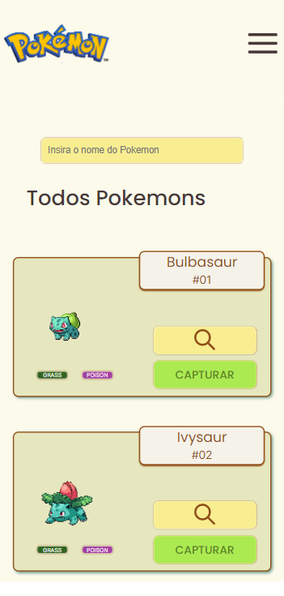
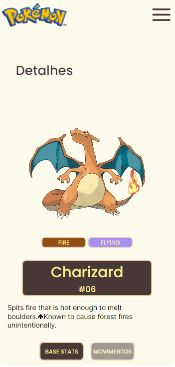

# Pokedex 

## 📖 Introdução 

A Pokedex é uma aplicação web que contém as principais informações dos 1008 pokemons, como: nome, tipo, movimentos, entre outros, utilizando a API [PokeApi](https://pokeapi.co/).

| [<br><sub>Detalhes</sub>](https://github.com/DanielEmidio1988) |
| :---: |

## 🔗Link de Acesso
- Deploy Vercel: [clique aqui!](https://pokedex-ruddy-tau-65.vercel.app/).

## 👥Equipe
| [<br><sub>Daniel Emidio</sub>](https://github.com/DanielEmidio1988) |
| :---: |

## 🧭Status do Projeto
- ⏳Concluido

## 📄Concepção do Projeto

### Instalando
```bash
# Instalando dependências
npm install

# executando o projeto
npm start
```

### Layout Mobile

| [<br><sub>Home Page</sub>](https://github.com/DanielEmidio1988) | [<br><sub>Detalhes</sub>](https://github.com/DanielEmidio1988) |
| :---: | :---: |


### Funcionalidades
. **Listagem:**: Listagem de todos os 1008 pokemons existentes, organizados por página (20 em cada);
. **Filtro:**: Filtrar pokemon pelo nome;
. **Detalhes:**: Cada card exibirá informações detalhadas como Base Stats (estatisticas) e Movimentos ao ser clicado;
. **Captura**: Adicionar pokemons a sua Pokedex pessoal;
. **Responsividade:** Aplicação totalmente responsiva para Desktop, Tablet e Celulares;

### Bibliotecas Utilizadas

```bash
styled-components
axios
react-router-dom
```

## 💡Programas utilizados:
- VSCode

## 💻Tecnologias 


## 📫 Contato

E-mail: emidio.daniel@hotmail.com

[](https://www.linkedin.com/in/danielemidio1988/)
[](https://www.codewars.com/users/DanielEmidio1988)
